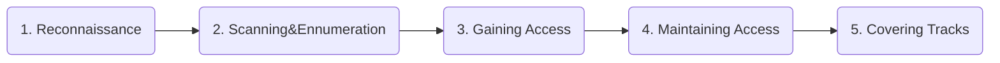

---
### Sommaire :

- [[#Defining Pentesting]]
- [[#Phases]]
- [[#Types of Attack]]
- [[#Security, Functionality and Ease of Use]]

---

## Definition 

 - **Pentesting** for profit = Pentration testing conducted by security team
- **Threat** : Situation that could lead to a breach
 - **Vulnerability** : logic design or implementation error that can lead to unexpected intrusion to the system
- **Exploit** : Piece of software leading to unauthorized access ..
-  **Attack** : When a system is compromised based on a vulnerability
- **Risk** : Probability of a threat
-  **Target of Evaluation** : Target subject of security analysis or attacj

---

# Defining Pentesting 

- Act in professional manner =/= hacker 
- Trust by the client and not damaging their systems
- Use their skills for defensive and protective puropose

### White HAT :
-> Ethical Hackers, Professional with knowledges
-> Permission from the data owner

### Grey HAT : 
-> Work offensivly and defensivly
-> Less malicious than black hat
-> Self proclaimed ethical Hackers

### Black HAT :
-> Malicious Guy
-> Destroy data, system ...

### Ethical Hacker : 
1. Confidentiality
2. Authenticity
3. Integrity
4. Availability

---

# Phases 
5 phases :

## 1. Reconnaissance :

> - First phase of the attack when the Hacker try to collect information about the target.
> - Identifying the Target include : Finding out Target's IP address Range, Network, DNS records etc.

> Gathering Information about **how**, **when** and **where** the ToE does things
> Identifying patternes of behavior.

#### Competitive Intelligences
> Means information avout competitors' products, marketing and technologies.

> 2 mods : Active and Passive

| Active                                                | Passive                                                     |
| ----------------------------------------------------- | ----------------------------------------------------------- |
| Directly Interacting with the target                  | Collect information about the tartget without direct access |
| Nmap, Dirbuster, Ping, Flood ping  TTL, Traceroute | Osint, Collect Data, etc                                    |
> Traceroute can be use to know where the ping went 

#### Social Engineering 
> It's a non-technical method of breaking into a system by convincing a victim to perform acts useful for an hacker.
> Example : Send a malicious pdf from admin mail and let an employes click on the malecious file etc.

There is 2 types of Social Engineering Attacks

| Human Base                               | Computer Based    |
| ---------------------------------------- | ----------------- |
| Impersonating an Employe or a Valid User | Email Attachments |
| Intimidation from an important user      | Fake websites     |
| Using a third person                     | Pop-up windows    |
| Calling technical support                |                   |

Types of attacks : 

| Attack         | Description                                                                 |
| -------------- | --------------------------------------------------------------------------- |
| Spear Phishing | Targeted mail to a specific targets                                         |
| Smishing       | 'SMS phishing' Send a sms to trick people to give away personal information |
| CEO Fraud      | Attacker impersonate the CEO to trick internal people                       |
| Vishing        | Voice Phishing, phone calls to get personal information                     |
| Phishing       | Send mail to get personal information                                       |

#### Osint (Open Source Intelligence)
> Gather information about something or someone thanks to internet and public information

-> Speciality Search Engines : Way-back machine; FindpdfDoc ...
-> IP,DNS,Web-footprinting : DIG service, wiggle.net ...
-> Breach Data : have i been pwned?, dehashed, pastbin ...
-> IOT: Shodan
-> Frameworks : Osint.com

##### Google dorks 

> [Google hacking database](https://www.exploit-db.com/google-hacking-database) 

![[Pasted image 20241026174326.png]]

## 2. Scanning and Enumeration 

#### 1/ Port Scanning 
> This phase involves find wich services and versions of the service is running on the system. Example : Nmap 

#### 2/ Vulnerability Scanning 
> Checking for the vulnerabilities or weakness of services found before which can be exploited
> Example : Search Sploit , Metasploit, Nmap scripts etc

#### 3/ Network Mapping 
>Finding informations about the network, routers, firewals, servers ... And drawing a network diagram.

![[Pasted image 20241026174603.png]]
#### NMAP 
nmap is a free open source tool very powerfull to perform port scan etc...
 - See this doc -> [nmap cheatsheet](https://github.com/Romso94/Cybersecurity-Learning/blob/main/Pentest/Serveur%20Enum%C3%A9ration/NMAP.md)

Usefull ports and protocol : 

| Port  | Protocol        |
| ----- | --------------- |
| 20-21 | FTP             |
| 22    | SSH             |
| 23    | Telnet          |
| 25    | SMTP            |
| 80    | HTTP            |
| 161   | SNMP            |
| 389   | LDAP            |
| 443   | SSL/TLS ->HTTPS |
| 445   | SMB             |
| 3389  | RDP             |

## 3.Gaining Access

> With Phase 1 and 2 Hackers has recolted a lot of information and try to enter in the system.
> The goal is to get access to the system 
> Example : reverse shell, malicious pdf etc ...

## 4. Maintaining Access 

> Hacker is already in the system and try to install backdoor to gain access when he want 
> This can be done by rootkits, trojans, malicious files etc. Aim is to stay in the system.

## 5. Covering Tracks

> After his attack the hacker will try remove every tracks he let in the system 
> Exemple : logs, command history, Email sent etc ...
>Anti-forensics is a notion encompassing all methods and tools which exist to
>delete, change or conceal digital evidence, with the ultimate goal being the
>manipulation, destruction or erasure of digital evidence.

---

# Types of Attack

> There is many methods and tools for locating vulnerabilities, running exploits and compromise a system.

## Testing Types :

### Black-box Testing :

> Performing a security evaluation like a malecious hacker 
> No information gave by the system tested. The goal is to simulate a real attack by malicious hacker.
> There is a long recon and scanning phase. Those type of testing take the longest time

### Grey-box Testing : 

> Testing internally the security evaluation of a system. Simulate attack perform by employes inside the network. 
> The goal of this test is to audit the level of access given to employes on the system

### White-box Testing :

> Security evaluation with complete knowledge of the network like the administrator would have.
> This test is faster than the grey and black and the goal is to identify quickly vulnerabilities without recon and scan.

---

# Security, Functionality and Ease of Use

![[1703069508144.jpg]]

> The goal in security is to balanced those 3 points. High level of security is important but it should not impact the functionality and the ease of use of the product. 

| Rôle                                     | Description                                                                                                                                                                 |
| ---------------------------------------- | --------------------------------------------------------------------------------------------------------------------------------------------------------------------------- |
| **CISO**                                 | Chief Information Security Officer                                                                                                                                          |
| **Security Administrator**               | Installe et gère les systèmes de sécurité de l'organisation. Peut également assumer certaines tâches d'un analyste de sécurité dans les petites organisations.              |
| **Cryptanalyst**                         | Décrypte les codes/chiffres ou détermine l'objectif des logiciels malveillants.                                                                                             |
| **Cryptographer**                        | Travaille comme chercheur pour développer des algorithmes de cryptage plus solides.                                                                                         |
| **Security Engineer**                    | Enquête et utilise de nouvelles technologies et processus pour améliorer les capacités de sécurité et mettre en œuvre des améliorations.                                    |
| **Security Analyst**                     | Analyse et évalue les vulnérabilités de l'infrastructure, enquête sur les outils et contre-mesures disponibles pour y remédier.                                             |
| **Penetration Tester**                   | Exploite les vulnérabilités pour fournir des preuves qu'elles existent.                                                                                                     |
| **Computer Security Incident Responder** | Monte une réponse rapide aux menaces et attaques de sécurité comme les virus et attaques par déni de service.                                                               |
| **Security Software Developer**          | Développe des logiciels de sécurité pour la surveillance, l'analyse du trafic, la détection d'intrusion, la détection de virus/spyware/malware, et les logiciels antivirus. |

> Ethical Hackers doesn"t fix any security holes they may find in the ToE

