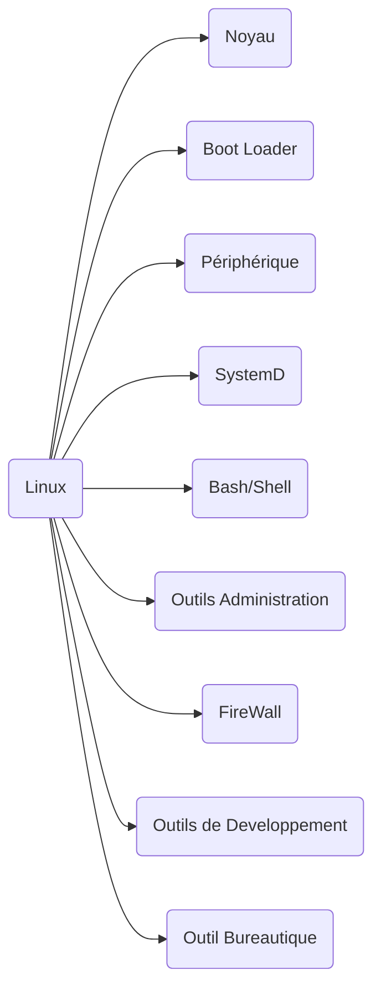
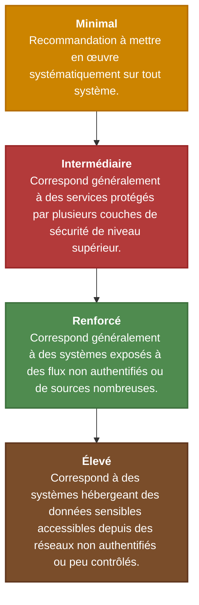

---

## Sommaire :

1. [[#Sécurité Linux]]
2. [[#Sécurité windows]]


--- 

## Important 

Depot signés ->  assuré l'intégrité des éléments telechargé sur le dépot ( clé GPG etc)
Centraliser les logs -> Faciliter la surveillance et tracabilité
CoreDump -> Image memoire a la fin d'un processus donc acces = limiter l'acces a des processus non autorisé
PATH root pas user courant -> Eviter une privesc et execution avec des privileges supérieur


--- 

## Architecture des OS - Noyaux 

![[Pasted image 20241027135220.png]]
#### Noyau Monolithiques Non Modulaire

- Facilité de conception et developpement
- Performant mais difficile a maintenir
- Pilotes et fonctions systeme toutes regroupé dans 1 seul bloc de code et 1 seul bloc binaire généré a la compilation
![[Pasted image 20241027135451.png]]

#### Noyaux Monolithiques Modulaires 

- Seules parties fondamentales du systeme regroupé dans un bloc de code unique =  monolithique
- Exemple : Linux
- Autres Fonctions et  Pilotes Matériels regroupé dans des modules séparés ( point de vue du code et du binaire)
- Facilité de maitenance et chargement à chaud
- Erreur dans un module mets la stabilité de tout le systeme en danger 

#### Systèmes à micro-noyaux

- Petit nombre de fonctions fondamentales conservé dans un noyau minimaliste appelé micronoyau ( 50 000 lignes de code contre plusieurs millions pour un noyau monolithique)
- Reste des fonctionalites fournis par des serveurs indépendants avec le propore espace d'adressage
- Gain en robustesse, fiabilité et ficilité de maintenance et d'evolutivité
- Trop d'appels systemes et interfaces de traitements IPC complexe donc lourdes en temps de traitements

![[Pasted image 20241027140327.png]]

#### Monolithique VS Micro-Noyau 

![[Pasted image 20241027140412.png]]

#### Noyaux Hybrides 

- Combine l'avantage des 2 : 
	- Fonctions non critiques  mais générant bcp d'appels systèmes, réintégré dans l'espace noyau
	- Performance amélioré en gardant bcp de propriété du micro-noyau
- Exemple : noyau XNU de Mac Os combinant micro-noyau Mach 3.0 et inclut du code du noyau monolithique BSD

![[Pasted image 20241027140727.png]]

#### Exo-Noyau 

- Abolition du probleme d'abstraction des systemes monolithiques et permission d'etre plus proche du materiel pour les dev
- Séparation de protection et gestion des ressources. Le Noyau protege les ressources materielles mais delegue la gestion aux applications
- Exemple : MirageOs

![[Pasted image 20241027140929.png]]

---

## Système Linux

#### Philosophie UNIX 
> 9 commandemants 

1. La concision est merveilleuse
2. Ecrire des programmes qui font UNE SEULE chose mais bien
3. Concevoir un prototype 
4. Preference pour la portabilité a l'efficacité
5. Stockage des données en TEXTE
6. Utilisez le logiciel comme une force
7. Utilisez des scripts shell
8. Evitez les UI captives
9. Chasue programe = un filtre

#### Noyau Linux 

> Noyau Monolithique Modulaire

- Interface graphique ne fait pas partie du noyau




--- 

## Sécurité Linux 

### Niveau de durcissement


> Niveau de durcissement recommandé par l'ANSII

 Le système d'exploitation joue un rôle important sur une machine 

- Les mesures de durcissement sont mise en place en fonction du niveau de sécurité attendu

- Le niveau dépend de la sensibilité des données manipulés par le systeme et la robustesse des controles d'acces aux ressources.

	> Un service exposé plubiquement avec un controle d'acces faible requiert un niveau de durcissement plus elevé qu'un serveur de sauvegarde résidant sur un réseau isolé et uniquement accessible a quelques personnes.


#### Exemple de niveau de durcissement 

![[Pasted image 20241027142535.png]]


## Principe généraux de sécurité et de durcissements 

> 4 grands principes 

1. [[#Principe de Minimisation]]
2. [[#Principe de moindre privilège]]
3. [[#Principe de défense en profondeur]]
4. [[#Activité de veille et maintenance]]

#### Principe de Minimisation

- Ce principe indique que tous système conçu et installé doivent éviter autant que possible toute complexité afin :
	- Réduire la surface d'attaque au strict minimum
	- Permettre une mise a jour et un suivi efficace du système 
	- Simplifier l'activité de surveillance car moins de composant

- Ce principe est délicat a respecté car il peut se retrouver en contradiction avec d'autres principes tout aussi importants
- Faire des choix raisonnables.

#### Principe de moindre privilège - Renforce et Elevé
- Attribuer les droits strictement nécessaire a l'exécution de tout objet ou entité gérée par le system et rien de plus.
- Gain en sécurité et en sureté : 
	- Conséquences de dysfonctionnement limitées aux privilèges octroyés
	- Réduit les potentiels escalade de privilège en cas de compromission du système

- D'autres mécanismes sont apparus pour contrôler aux mieux les droits (contrôles d'accès) : 
	- SELinux, AppArmr, les capacités POSIX, les namespaces ou les solutions a base de conteneurs (Docker, LXC )

#### Principe de défense en profondeur 

- Conception de plusieurs couches de sécurité ==indépendantes== et ==complémentaire== pour ralentir un attaquant
- Chaque couche de sécurité est un point de résistance a franchir pour l'attaquant
- Chaque couche doit permettre une réaction rapide en cas d'intrusion (signaux, alarmes, messages de journalisation) afin de détecter au plus vite une attaque.
- Avantages :
	- Détection
	- Facilité de remediation
	- Amélioration de la sécurité

#### Activité de veille et maintenance

- Il est important d'applique les mesures correctives et essentielles pour corriger des vulnérabilités ( Procédure de mise a jour régulière et réactive)
- Tout système doit être surveillé afin d'en contrôler les dérives ( journalisation des activités des services)
- Les journaux d'activités doivent être stocké et archivé sur un système externe


### Gestion des privilèges


![[Pasted image 20241027154338.png]]

Model d'accès est un DAC ( Contrôle d'Accès Discrétionnaire)

discrétionnaire :  l'utilisateur propriétaire d'une ressource est celui qui spécifie les droits d'accès


##### Besoin de programmes privilégiés

Mot de passes stocké dans etc/shadow


##### Approche à deux niveaux

Un système de contrôle d'accès granulaire rend le système d'exploitation trop compliqué
Il doit s'appuyer sur des programmes privilégiés

#### Types de programmes privilégiés

- Daemons : 
	- Programme qui s'execute en arriere plan
	- Doit s"executer en que root ou autre utilisateur privilégié
- Programmes Set-UID : 
	- Largement utilisé dans UNIX
	- Programme marqué d'un bit spécial

#### Superman 
Combinaison de pouvoir comme le mécanisme Set-UID implémenté dans les systemes linux

#### SET-UID 

- Autoriser l'utilisateur a exécuter un programme avec le privilèges du propriétaire du programme ( droit temporaires)

- Exemple le programme passwd

Chaque processus a 2 ID utilisateur 
- Real UID (RUID) : identifie le propriétaire du processus
- Effective UID ( EUID) : identifie les privilèges d'un processus

Un programme normalement exécuté : RUID = EUID

Lorsqu'un programme Set-UID est exécuté alors RUID =/= EUID car EUID est egal a l'id du propriétaire donc si root est propriétaire alors il s'execute avec les droits root


> CHOWN pour changer le propriétaire d'un fichier 

> Activer le Set-UID : chmod 4... fichier

Un programme Set-UID a un marquage spécial avec le bit Set-UID

#### Sécurité 
- Permets aux utilisateurs normaux de faire remonter les privilèges ( différent de sudo qui donne directement des privilèges)
- Dangereux de transformer tous les programmes en Set-UID ( /bin/sh ou vi dangereux d'avoir des executions en root dessus)


![[Pasted image 20241027160708.png]]

### Droits sur les fichiers
- Utilisateur pas explicite dans la demande de droit -> droit appliqué par défaut umask 0022, très permissif
- Recommandation de l'ANSII umask de 0027 par défaut ( tout fichier créé n'est lisible que par l'utilisateur et son groupe et modifiable uniquement par son propriétaire)
- Attention particulières sur les fichiers et répertoires suivants : 
	- Ceux contenant des éléments secrets ( mot de passes, clés ssh etc)
	- Exécutables possèdent des bits spéciaux ( setuid, setgid)
	- Répertoires temporaires 
	- les fichiers IPc ( comme les sockets ou les pipes permettant d'établir des caneaux de connexions)

> Il faut adapter les droits appliqué sur ces fichiers

Fichiers a contenu sensible  -> restreindre l'accès ( Défense en profondeur)
	-> Lisibles uniquement par les utilisateurs ayant le strict besoin de les lires

Fichiers exécutables en setuid ou setgid : 
	-> S'exécutent avec les privilèges de leur u ou g propriétaire et non celui de l'utilisateur courant
	-> Seuls les programmes conçu spécifiquement pour être utilisé avec les bit setuid ou setgid doivent avoir ce bit de privilège positionné

Analyser les fichiers dont le propriétaire ne fais pas parti de passwd

Analyser et corriger les droits sur les fichiers accessibles a tous en écritures
-> Chaque compte utilisateur/service doit posséder son propre répertoire temp  et en disposer exclusivement
	-> Créer un répertoire temp sur les versions récente de GNU/linux est l'utilisation de modules PAM ( comme pam_mktemp ou pam_namespace)
	Si l'exclusivité ne peut être garantie alors utiliser le Sticky Bit

Selon l'ANSSI : Tous les répertoires accessibles a tous en écriture doivent avoir le ==Sticky bit== d'activé

### Sudo 

Utiliser des listes de contrôles d'accès pour délèguera des droits sur des fichiers

Recommandations : 
	- Sudo doit être configuré pour être utilisé uniquement a partir d'un pseudo-terminal
	-  Utiliser un fichier de log

==ANSSI== : Un groupe dédier à l'usage de sudo doit etre créé et seulement les utilisateur de ce groupes doivent avoir le droit d'exécuter sudo

-> Permet de réduire la surface d'attaque


Configuration Sudo : 
![[Pasted image 20241027162549.png]]


-> Dans le fichiers SUDOERS  on doit préciser strictement les arguments autorisé et ne pas utiliser *
et l'absence d'argument doit être spécifié par une chaine vide ""

-> L'édition d'un fichier sudo doit se faire par la commande "sudoedit"
	Dans sudoedit l'editeur s'execute uniquement avec les privilèges de l'utilisateur courant et jamais les privilèges de l'utilisateur cible


## Installation et Configuration Système Linux

#### Partitionement type 

![[Pasted image 20241027163654.png]]

> Seul root doit avoir accès a /boot

System.map contient la table des symboles utilisée par le noyau et est donc a protéger.

/boot est nécessaire pour la mise a jour du noyau

> cas du /tmp : 
> 	- Répertoire écrit par tous utilisé pour stocker temporairement des informations
> 	- /tmp avec noexec rend inutile pour un attaquant d'installer du code exécutable dedans

Il faut également lors de l'installation, désactiver les systèmes de fichiers non-utilisé pour réduire la surface d'attaque locale du système

Si un type de système de fichier n'est pas nécessaire il doit être désactivé

Exemple : cramfs, squashfs ...

#### Choix des paquets 

-> Le choix des Paquets doit se conduire a l'installation la plus petite possible et sélectionner que ceux qui sont nécessaires
-> En cas de plusieurs dépôts, choisir celui avec le plus de durcissement

#### Mises à jour

-> La majorité des paquets utilise une clé GPG pour signer ces paquets et assurer leur intégrité

#### Chargeur de Démarrage 

Privilégier un chargeur de démarrage permettant de protéger le démarrage par mot de passe ( comme Grub par exemple) pour éviter que les options de configurations soient modifié par n'importe qui

#### Mot de passe root et comptes admin

Le mot de passe root doit être unique, propre a chaque machine et robuste

Il faut également définir différents niveaux de privilèges sur le systèmes en fonction des prérogatives des admins

==ANSSI== : Chaque admin doit posséder un compte dédié et ne pas utiliser root comme compte pour accéder a l'administration du système. 


#### Configuration et services système

Surveiller particulièrement les services exposés a des flux non maitrisés -> anssi : caractériser le comportement du service et reporter tout écart anormal du fonctionnement normal. 

Sysctl sont des variables qui permettent de paramétrer le systeme d'exploitation et le noyau

Agis sur plusieurs niveau : 


| Mémoire                  | Configurer la pagination, propriété de mapping, allocateurs   |
| ------------------------ | ------------------------------------------------------------- |
| **Réseau**               | IP, TCP, UDP, taille et caractéristiques des tampons          |
| **Noyau**                | Contrôle des caches, swap, scheduling                         |
| **Systèmes de fichiers** | setuid dumps, hard and soft links                             |
| **Processus**            | Ressources allouées, restrictions d'exécutions, cloissonement |


#### Gestion des comptes d'accès 

Désactiver les comptes utilisateurs non utilisés
Chaque compte de service doit être désactiver et chaque service doit posséder son propre compte système qui lui est dédié exclusivement.

Les sessions d'utilisateurs distantes ( shell, clients graphiques etc) doivent être désactivé après un certain délai d'inactivité.

#### PAM 

le PAM est un ensemble de modules sous linux permettant de configurer dynamiquement différents mécanismes d'authentification et de gestions de comptes sur un système linux.

-> Fournir principalement la gestion de compte

-> Modules PAM appelés par l'application, PAM peut vérifier des éléments au travers de bases de données local ( shadow par exemple) ou distante ( kerbnersos etc)

==ANSSI== : le nombre d'application utilisant PAM doit être réduit au strict nécessaire et PAM doit utiliser un protocole d'authentification sécurisé pour récupérer des éléments sur un serveur distant


---

# Sécurité windows

-> Années 2003 marqué par de nombreuses Attaques

Microsoft Réagis en formant ses développeurs a la sécurité : 
	-> Revues de code manuelles et automatisé
	-> Series de test systématiques

Repenser le système : 
	-> renforcer la ==sécurité par défaut==
	-> réduire les ==surfaces d'attaques==
	-> ==limiter les permissions== sur l' OS
	-> Respecter le principe de ==moindre privilège==

Evaluation du niveau de sécurité : 

> ==T==rusted ==C==omputer ==S==ystem ==E==valuation ==C==riteria

![[Pasted image 20241027171235.png]]

### Architecture Windows 

![[Pasted image 20241027171327.png]]


### Architecture Windows : User Mode

![[Pasted image 20241027182851.png]]

### Architecture Windows : Kernel Mode

![[Pasted image 20241027182914.png]]

### Schéma des Composants de Sécurité 

![[Pasted image 20241027182940.png]]


| Service                                            | Description                                                                                                                                                                                                                   |
| -------------------------------------------------- | ----------------------------------------------------------------------------------------------------------------------------------------------------------------------------------------------------------------------------- |
| Security Reference Monitor (SRM)                   | - In the Windows Executive(Ntoskrnl.exe)<br>- Define access token data structure<br>- Perform Security Access Checks on objects<br>- Manipulating privileges (user rights)<br>- Generate result about security audit messages |
| Local Security Authority Subsystem Service (Lsass) | Responsable for the local system security policy                                                                                                                                                                              |
| LSAIso.exe                                         | Credential Guard used by Lsass<br>- Store user's token hashes instead keeping them in Lsass memory<br>- Trustlet (Isolated User Mode process), can access address space of this process                                       |
| LSASS Policy database                              | Local system security policy settings<br>- Stored in the ergistry in an ACL-protected area ( under HKLM\SECURITY)                                                                                                             |
![[Pasted image 20241027195116.png]]

![[Pasted image 20241027195124.png]]

![[Pasted image 20241027195130.png]]

### Winlogon 

==Winlogon.exe== est un processus qui : 
	- gere les **ouvertures** et **fermetures** de sessions
	- déclenchement et arret des **écrans de veilles**
	- Verouillage/Deverouillage de la station de travail
	- Arret/redémarrage de la machine

- ==Trusted PATH== : 
	- Présente la boite de dialogue login/mdp de manière sécurisé

-> Au démarrage Winlogon crée 2 bureaux :
	1. Un bureau utilisateur interactif
	2. Un bureau ==sécurisé==

```
Il enregistre ensuite la séquence de touche [Alt][Ctrl][Suprr]
```
et y enregistre une fonction de **rappel**

- Avec l'utilisation de RegisterHotKey et SetWindowsHook, le système garantit qu'aucune autre application se mets a la place de Winlogon.

-> Si la séquence est entré alors ==Winlogon est appelé== et affiche le **bureau sécurisé**

/!\ Aucune autre application en mode user pourra lire le mdp saisi, la séquence de touche (Secure Access Séquence) garantit que c'est bien Winlogon qui gère la demande

Winlogon s'appui sur LogonUI : 
	-> Gère la conception de la fenêtre de connexion
	-> Fournisseurs d'information d'authentification ( Credentials Providers)
	-> Peut être cascadé pour une méthode d'authentification multiple
LogonUI récupère le nom d'utilisateur et le mdp tapé par le u et transmets de façon sécurisé au processus Lsass.exe ( LSA) pour authentification

#### Renforcement des Services 

- Windows XP : 
	Problèmes  : Attaque des services a partir d'un utilisateur log en session 0 -> privesc etc

-> Shatter Attack : 
	Système de communication basé sur envoi de message
	message peuvent être envoyé a toutes les applications d'une même session
	-> Le code malveillant envoie un message a un service et enregistre une fonction de rappel ( même effet que l'injection de code)
Donc parvient a exécuter un processus a privilèges élevés avec une maitrise du code


#### Solution 

-> Isolation des Services
Sécurités des Services : 
	- Moindre privilège
	- Octroyer uniquement les permissions nécessaires sur le système

### Compte de Service 

Les services natives Windows s'exécutes sous trois identités différentes : 
	1. ==Système Local== : 
		- Représente le système d'exploitation lui même (System ou NT_AUTHORITI/SYSTEM compte de sécurité avec le plus de priv et accès a la ruche de sécurité HKEY_LOCAL_MACHINE\SECURITE)
	2. ==Service Réseau== : 
		-Moins de privilèges que System Local
		- Listes de contrôles d'accès ACL plus restrictive que sur Système local
		- Pas besoin de permissions sur système local mais doit s'authentifier sur le réseau
	1. ==Service Local== :
		- Permissions réduite = un utilisateur standard, non-admin
		- Peut pas s'authentifier sur le réseau
		- Connexion anonyme a une ressource
		- Accès refusé si l'accès a la ressource a été restreint


Comptes utilisateur du domaine
- Même permission que ==Service Réseau== mais une gestion centralisé différente

> Exemple : Permissions d'accès a une ressource réseau octroyé a un groupe : 
> -Avec ==Service Réseau== : Chaque nouvel ordinateur devra être ajouté au groupe
> - Avec compte utilisateur du domaine : rien a faire


## SID de service 

SID ( Secure Identifier )
- Chaque service possède un SID attribué de façon unique
- SID positionné dans les permissions de ressources créées par un service pour s'octroyer qu'a lui les droits
- sc.exe pour visualiser les SID


## SID restreints

Compte utilisateur -> ressource, il présente son ==jeton d'accès== obtenu auprès du LSASS

##### Jeton : 
- SID unique de user
- SID des groupes auxquels il appartient
- Liste des privilèges en droit d'activer
- peut contenir SID restreints

Quand le system détermine accès a une ressource : 
-> Vérifie si le jeton possède ou non le ==SID restreints==
-> Lecture seul si c'est le cas 


## Contrer le buffer overflow

### DEP ( Data Execution Protection)

- Existe sous Windows xp et 2003 aussi
- Lutte contre l'exploitation du buffer overflow

	-> Installe des "canaries" lorsqu'ils sont plus dans la pile alors alerte sur un bufferoverflow et il peut arrêter l'exécution du programme
	Les systèmes Windows et la plupart des applis Microsoft sont compilé avec cette option

-> Prémunir du débordement de tas
- Fonctionnalités du processeur mise a contribution pour détecter ces problèmes 
	-> Registres Spéciaux (Debug registre) notés dr0 à dr3

Windows émule ces instructions si elles ne sont pas prisent en charge par le matériel

![[Pasted image 20241028150357.png]]


### ASLR ( Address Space Layout Randomization)

-> Le code malveillant peut accéder a la dll chargé tjr a la même adresse mémoire
Les DLL sont chargé a une adresse aléatoire.

Choisit par le système une position aléatoire parmi 256 possibles

Cela empêche pas le bufferoverflow mais ralentit et rend plus difficile sont execution
(il doit déterminer quelle adresse appelé)

La combinaison DEP - ASLR rend la création d'exploit difficile